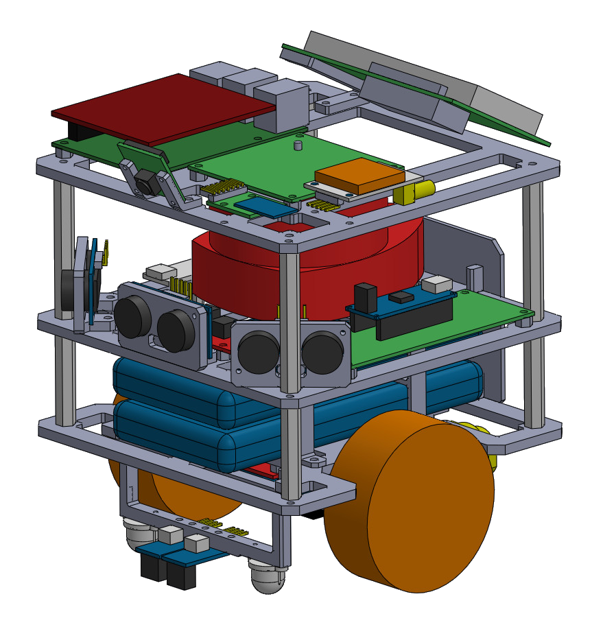
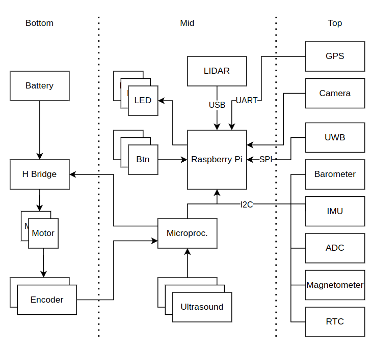

# Fenrir Project

The Fenrir Project is an open source of a multi purpose education robot dedicated for wide range of applications and usage in high-schools and universities.

The robot is based on Raspberry Pi 4 and Arduino Nano. The Raspberry Pi provides computational power, ROS2 support, WiFi connection and USB support. The Arduino Nano extends the PRi IOs and handles peripherals.

The development is currently still under development

## Robot Overview

Robot visualization 

Overview schematics

## Authors

Adam Ligocki 

