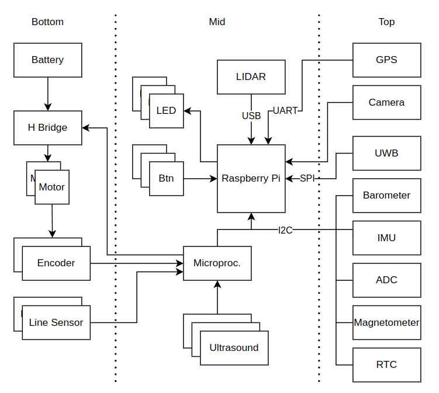

# Fenrir Project

The Fenrir Project is an open source of a multi purpose education robot dedicated for wide range of applications and usage in high-schools and universities.

## Robot Overview

Robot visualization 

Overview schematics

## Authors

Adam Ligocki 

