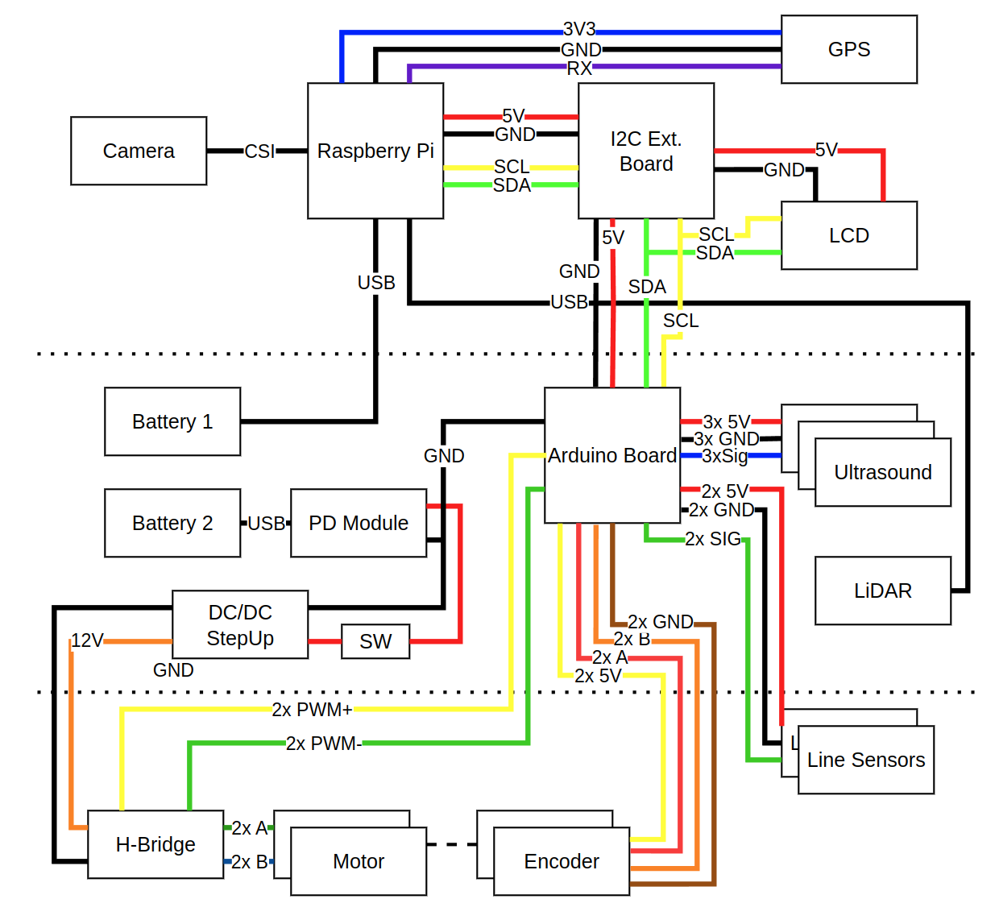

# Fenrir Project - Universal Robotic Platform

The Fenrir Project is an open source of a multi purpose education robot dedicated for wide range of applications and usage in high-schools and universities.

The robot is based on Raspberry Pi 4 and Arduino Nano. The Raspberry Pi provides computational power, ROS2 support, WiFi connection and USB support. The Arduino Nano extends the PRi IOs and handles peripherals.

The development is currently still under development

## Robot Overview

Robot visualization 

Overview schematic

Power supply schematic

Wiring

## Equipment

| Role                   | Component           | URL                                                                                      |
|------------------------|---------------------|------------------------------------------------------------------------------------------|
| Main Computer          | RPi                 | [link](https://cz.mouser.com/ProductDetail/Raspberry-Pi/SC01959?qs=T%252BzbugeAwjhNCW2QVhlotw%3D%3D)                                                                                         |
| Helper Microcontroller | Arduino Nano        | [link](https://www.laskakit.cz/arduino-nano-r3--atmega328p-klon--pripajene-piny/)                                                                                         |
| 2x Battery             | Powerbank 10000 mAh | [link](https://www.alza.cz/alzapower-parade-power-delivery?dq=7177723)                                                                                         |
| Camera                 | RPi Camera v2       | [link](https://rpishop.cz/mipi-kamerove-moduly/329-raspberry-pi-kamera-modul-v2.html?utm_source=google&utm_medium=cpc&utm_campaign=CZ-PMax-Raspberry%20Pi&utm_id=19691368073&gad_source=1&gclid=Cj0KCQiAr7C6BhDRARIsAOUKifiiX4p72F4J8UeeA5uyoK2IDEEryKLRjE0e5gLhURTCTTf2cGW-ZpQaAr76EALw_wcB)                                                                                         |
| GPS                    | NEO-7M module       | [link](https://dratek.cz/arduino/1733-gps-satelitni-urceni-polohy-neo-7m-modul.html?_gl=1*16f2vtr*_up*MQ..*_gs*MQ..&gclid=Cj0KCQiAr7C6BhDRARIsAOUKifhd7u9T5IjiCyc4w0n-WqehlzG5F2pNwJ4JP5M_eQDHW-daU_NkSKYaAn-_EALw_wcB)                                                                                         |
| 2D LiDAR               | RPLiDAR A1M8        | [link](https://rpishop.cz/lidary/1631-rplidar-a1m8-360stupnovy-laserovy-scanner-kit-dosah-12m.html)                                                                                         |
| LCD                    | HD44780 20x4 I2C    | [link](https://dratek.cz/arduino/1421-eses-i2c-20x4-display-pro-jednodeskove-pocitace.html?_gl=1*16f2vtr*_up*MQ..*_gs*MQ..&gclid=Cj0KCQiAr7C6BhDRARIsAOUKifhd7u9T5IjiCyc4w0n-WqehlzG5F2pNwJ4JP5M_eQDHW-daU_NkSKYaAn-_EALw_wcB)                                                                                         |
| 3x Ultrasound          | SRF-05              | [link](https://dratek.cz/arduino/1735-meric-vzdalenosti-ultrazvukovy-5pin-hy-srf05-pro-arduino.html?gad_source=1&gclid=Cj0KCQiAr7C6BhDRARIsAOUKifhd7u9T5IjiCyc4w0n-WqehlzG5F2pNwJ4JP5M_eQDHW-daU_NkSKYaAn-_EALw_wcB)                                                                                 |
| 2x Line Sensor         | TCRT5000 module     | [link](https://www.laskakit.cz/arduino-infracerveny-senzor-sledovani-cary-s-lm393/)      |
| H Bridge               | L298N module        | [link](https://www.laskakit.cz/h-mustek-pro-krokovy-motor-l298n--dualni-motorovy-modul/) |
| Motor with Encoder     | DG01D‐E             | [link](https://cz.mouser.com/ProductDetail/SparkFun/ROB-16413?qs=vmHwEFxEFR%2F20T1Ah9zr5w%3D%3D) |
| IMU                    | MPU6050             | [link](https://pajenicko.cz/gyroskop-akcelerometr-gy-521-s-mpu6050-i2c) |
| Barometer              | BME280              | [link](https://pajenicko.cz/senzor-na-mereni-teploty-vlhkosti-tlaku-bme280) |
| Real Time Clock        | DS3231              | [link](https://www.laskakit.cz/arduino-rtc-hodiny-realneho-casu-ds3231-at24c32/?utm_source=google&utm_medium=cpc&utm_campaign=1_PMax_%5BCZ%5D_Top_tROAS_540&utm_id=18587021915&gad_source=1&gclid=Cj0KCQiAr7C6BhDRARIsAOUKifg6UUgWdBpultpbW-joaJkbae34LBj8l6PJlVsHSvLgqnOoyetU0BsaAva-EALw_wcB) |
| ADC                    | ADS1115             | [link](https://pajenicko.cz/ad-prevodnik-ads1115-s-programovatelnym-zesilenim-16bit-4-kanaly-i2c-rozhrani) |
| UWB (not yet)          | DWM1000             | [link](https://www.laskakit.cz/decawave-dwm1000-lokalizacni-modul/) |
| DC/DC Step Up          | XL6009              | [link](https://www.laskakit.cz/step-up-boost-menic-s-xl6009--cervena/) |
| Power Delivery         | USB-C PD module     | [link](https://www.laskakit.cz/usb-c-pd-qc-prepinac-napajeciho-napeti/?utm_source=google&utm_medium=cpc&utm_campaign=1_PMax_%5BCZ%5D_Rest_tROAS_540&utm_id=20484705754&gad_source=1&gclid=Cj0KCQiAr7C6BhDRARIsAOUKifjczsmkcfvSqKLF3lqhT2G3EaCcH9kkrkxwS225di7C_nkNrmd77JoaAueFEALw_wcB) |
| Switch                 |                     | [link](https://pajenicko.cz/kulaty-kolebkovy-spinac-se-zelenou-led-12v-20a) |

## Bill Of Material

## Authors

Adam Ligocki 

