# 3D Printed Components

This chapter presents all parts to be 3D printed. 

Recommendations
 - Printer: Prusa MK4
 - Slicer: Prusa Slicer
 - Filament: Prusament PLA or PETG
 - Infill: 30%
 - Layer height: 0.2mm
 - Infill pattern: gyroid

### AR Tag Plate - 1x

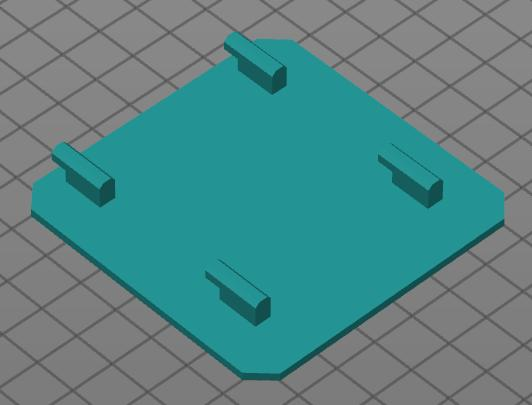

### Battery Holder - 2x

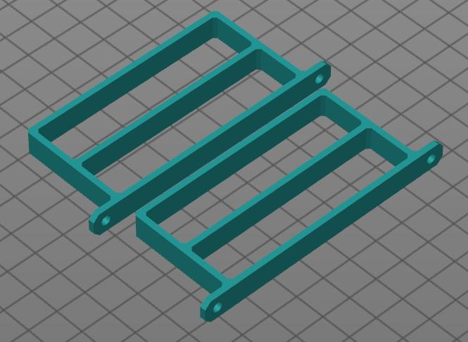

### Camera Mounts - 2x

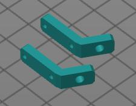

### Front Leg - 1x

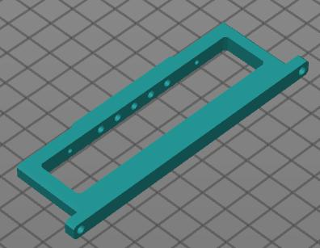

### Rear Leg - 1x

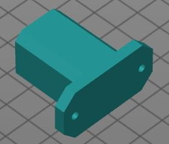

### LCD Mount - 1x

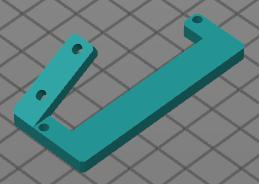

### Plate Bottom - 1x

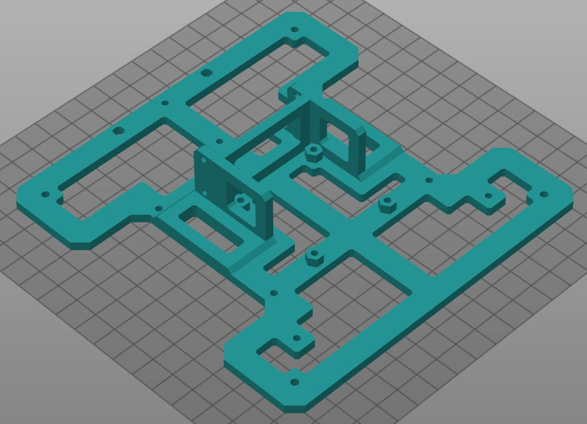

### Plate Middle - 1x

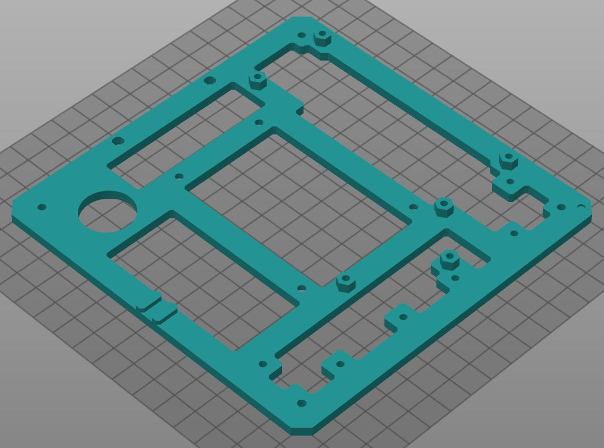

### Plate Top - 1x

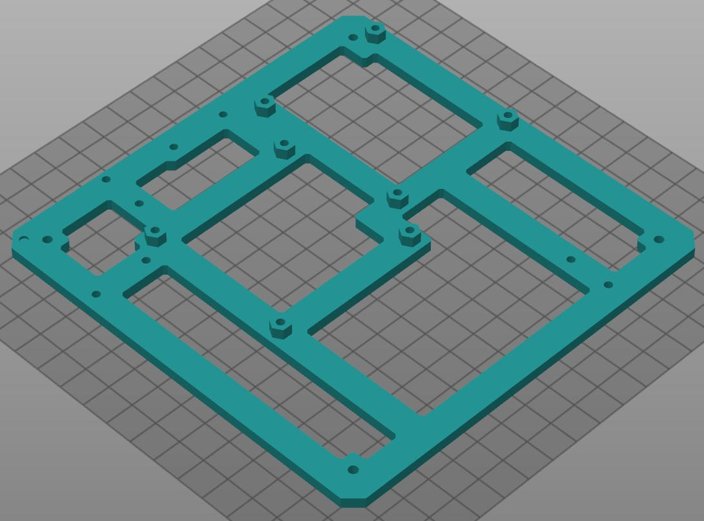

### SRF05 Mount - 3x

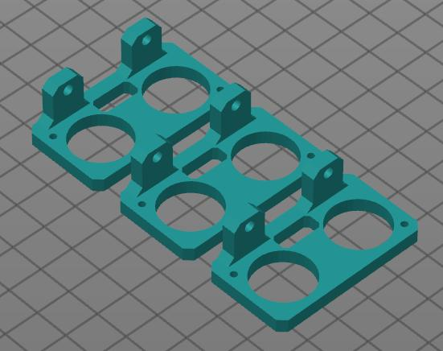

### Stand - 1x

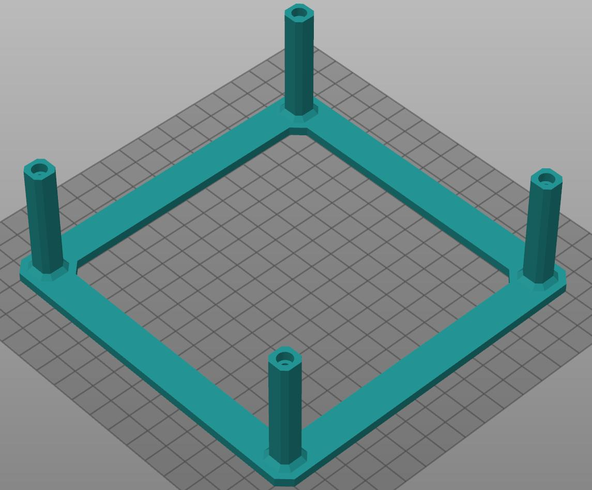

### Wheels - 2x

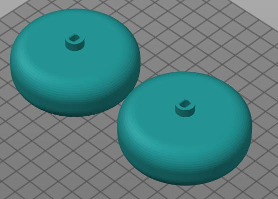
