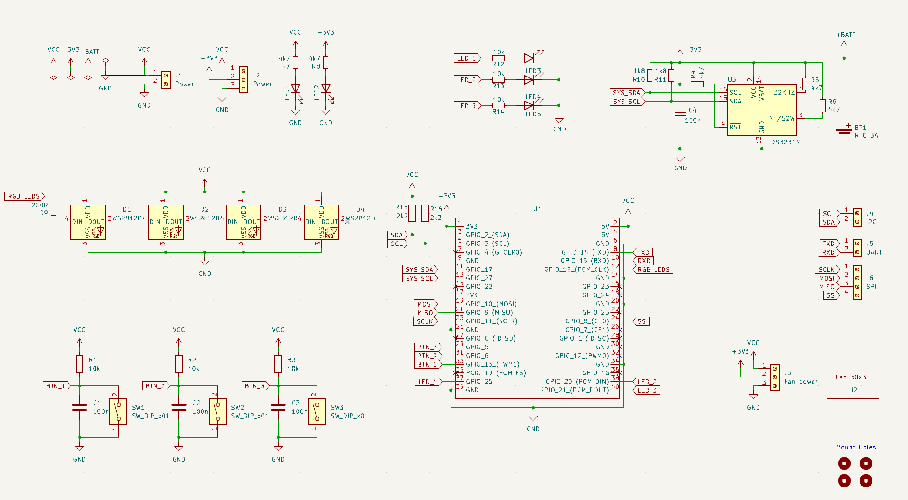
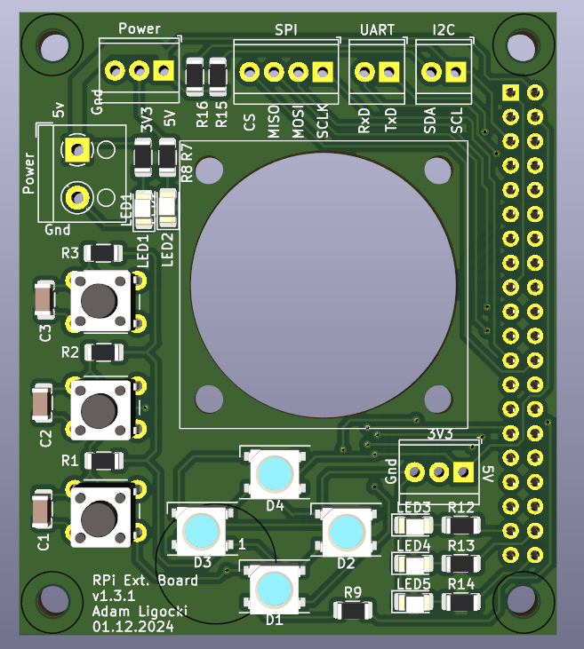
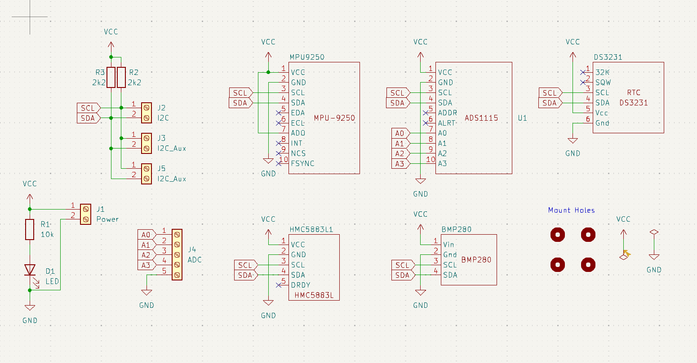
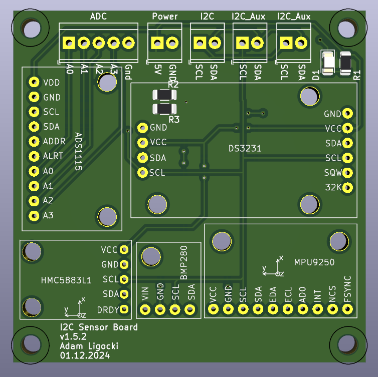
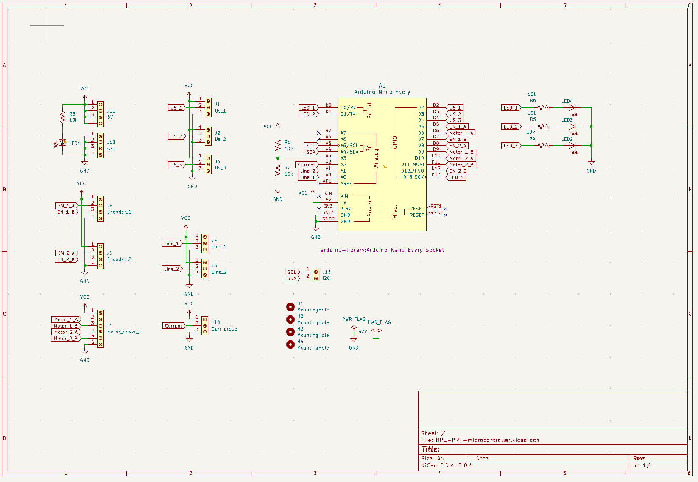
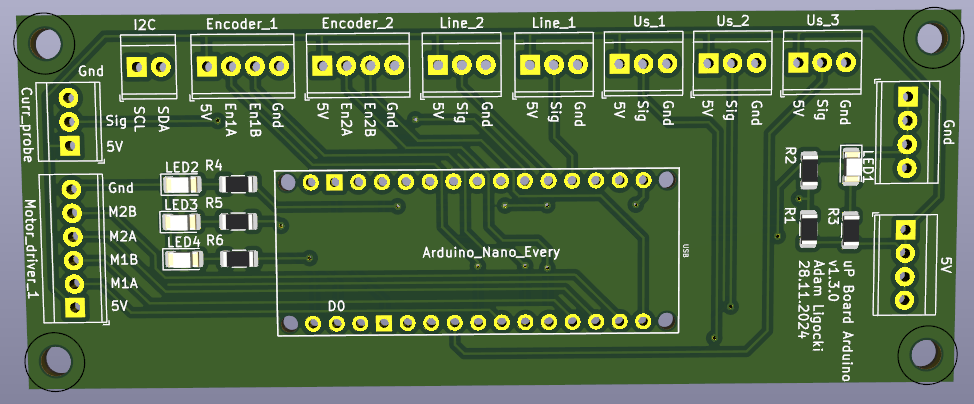

# Custom PCBs

This chapter shows the custom PCBs designed for the Fenrir Project.

Robot includes 3 custm PCBs in total with following functionalities:

 - Raspberry Pi Sield (header)
   - power supply
   - I2C bus
   - SPI bus
   - UART bus
   - Fan cooling
   - Buttons
   - LEDs

 - I2C Sensor Board
   - IMU (Acc + Gyro)
   - Barometer
   - Magnetometer
   - ADC
   - RTC

 - Arduino Nano Board
   - I2C bus
   - Motor Control
   - Motor Encoders
   - Ultrasonic Sensor
   - Line Sensors

Please see the `/pcbs` folder in the root of the repository for more details.

### Raspberry Pi Shield

### I2C Sensor Board

### Arduino Nano Every Board

