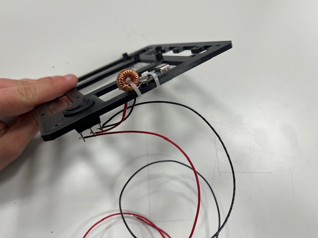

# Robot Assembly

### Step 1 - Battery holder mount

- Bottom part
- Battery holders (2x)
- Screw M3x6 (4x)

### Step 2 - Front Leg mount

- Front leg
- Screw M3x6 (2x)

### Step 3 - H-Bridge mount

- H-bridge
- screw M3x6 (4x)

### Step 4 - Standoffs

- Standoff (4x)
- Screw M3x6 (4x)

### Step 5 - Rear Leg mount

- Rear leg
- Screw M3x6 (2x)

### Step 6 - Roller Casters mount

- Roller caster (3x)
- Screw M2x4 (6x)

### Step 7 - Motors mount

- Motor with 6-wire cable (2x)
- Screw M3x25

### Step 8 - Line Sensors mount

- Line sensor with 3 wires (2x)
  - vcc (red)
  - gnd (black) 
  - signal (blue) 

### Step 9 - Middle, Switch

- Middle part
- Switch
- USB power delivery module
- Wires (red & black)

### Step 10 - Arduino Board

- Arduino board
- Screw M3x6 (4x)

### Step 11 - LiDAR Mount

- LiDAR with UART to USB converter and 4 screws

### Step 12 - Ultrasound Module assembly

- Ultrasound sensor
- 3 wires 
  - vcc (red)
  - gnd (black)
  - signal (blue)

### Step 13 - US Modules mount

- Ultrasound module (3x)
- Screw M3x6 (6x)

### Step 14 - DC/DC Stepup mount

- DC/DC stepup
- Screw M3x6 (2x)

### Step 15 - Top, LCD

- Top Part
- LCD mount
- LCD
- Wires 
  - vcc (red)
  - gnd (black)
  - sda (green)
  - scl (yellow)

### Step 16 - RPi, Camera

- Raspberry Pi 4
- RPi camera v2
- Camera mount
- 4x screw M2x3

### Step 17 - RPi Module mount

- RPi module

### Step 18 - Sensor Board mount

- Sensor board
  - IMU
  - ADC
  - RTC
  - Magnetometer
  - Barometer

### Step 19 - RPi Hat mount

 - RPi Hat

### Step 20 - Bottom Module wires alignment

### Step 21 - Mid Module wires alignment

### Step 22 - Bot & Mid merge

- Bottom module
- Mid module
- Standoff (4x)

### Step 23 - Connecting Encoders to Arduino Board

- Left motor -> encoder 1
- Right motor -> encoder 2

### Step 24 - Connecting US modules

- Left US -> us_1
- Center US -> us_2
- Right US -> us_3

### Step 25 - Top Module mount

- Top module
- Screw M3x4 (4s)
- Wires (RPi power -> Arduino Board) 
  - 5V (red)
  - gnd (black)

### Step 26 - Connecting I2C RPi <-> Aruino Board

- Wires
  - sda (green)
  - scl (yellow)

### Step 27 - Wiring Arduino Board -> H-Bridge
- Left motor
  - M1A -> N1 (yellow)
  - M1B -> N2 (green)
- Right motor
  - M2A -> N3 (yellow)
  - M2B -> N4 (green)

### Step 28 - Connecting RPi Power to Sensor Board
 - vcc 5V (red)
 - gnd (black)
 - sda (gree)
 - scl (yellow)

### Step 29 - Power Up

### Step 30 - Wheels

- Wheel (2x)

### Final

