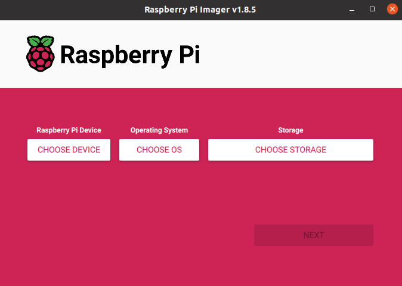
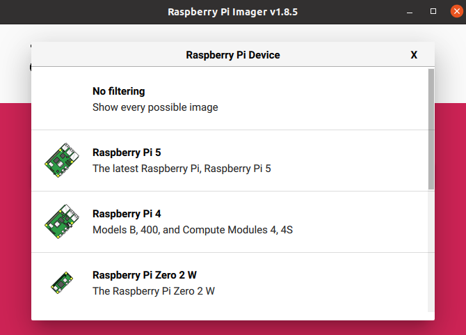
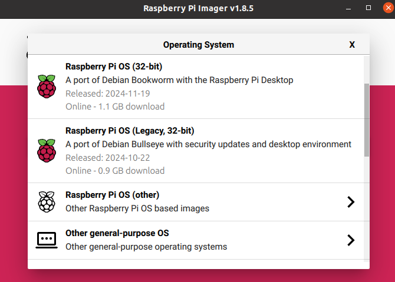
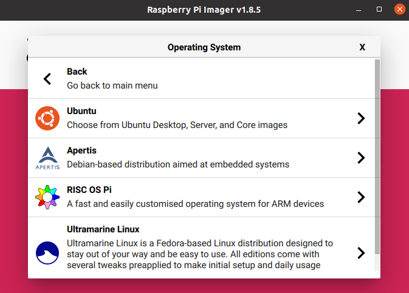
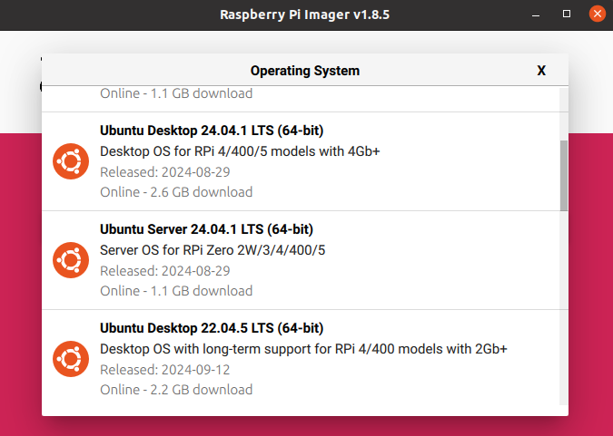
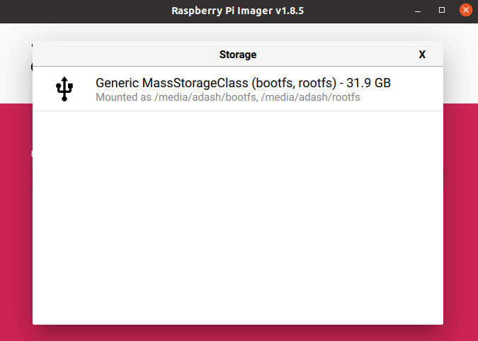
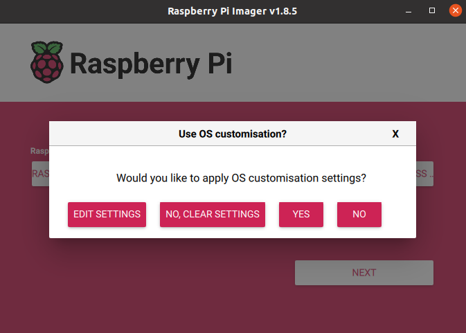
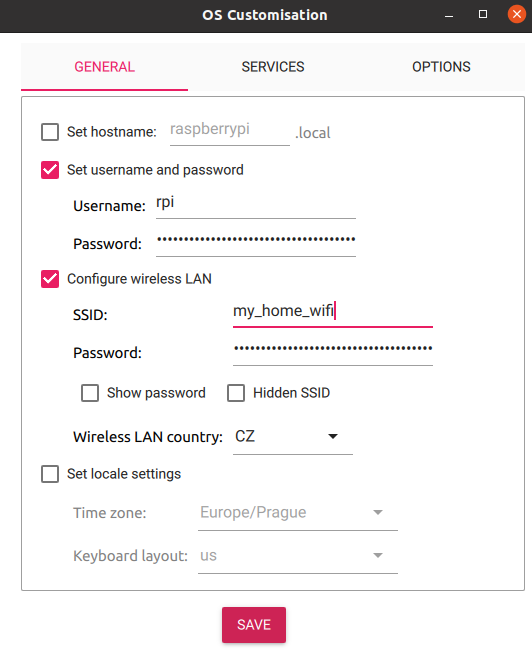
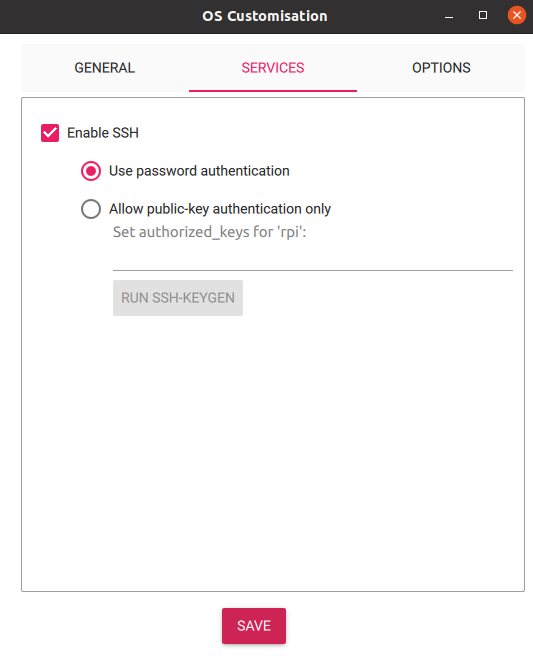
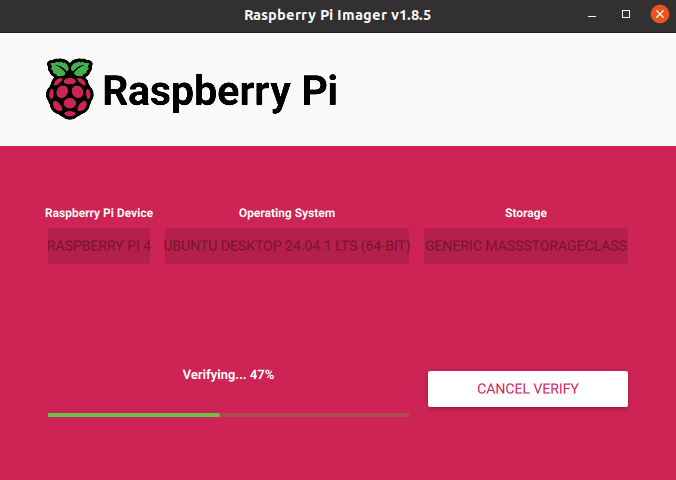

# RPi Installation

## Required HW

 - Respberry Pi 4B (8GB RAM recommended)
 - Micro SD Card (minimal 16GB, 64GB recommended)
 - SD Card to USB Adapter

## Installation


Install RPi-Imager on your Linux PC

```
sudo apt install rpi-imager
```

Run RPi-Imager

```
rpi-imager
```



Select Device (Raspberry Pi 4)



Select OS - Others General Purpose OS -> Ubuntu -> Ubuntu Server 22.04.5 LTS (64b)







Select target device (SD Card)



Click Next -> Edit Settings



Setup user, password, WiFi and SSH





Confirm and wait until writing is finished.



Now put the SD card into the RPi and power on.

In case of problems, please visit [Official Documentation](https://www.raspberrypi.com/documentation/computers/getting-started.html#install-using-imager) 

## OS Configuration

Connect to the raspberry pi

```
ssh <user>@<ip_address>
```

Run first installation script and reboot after, script may need user input for confirmation on restarting services
```
sudo bash first_start.sh
sudo reboot now
```

Script will:
- run system update and upgrade some system packages
- change boot firmware config
- create swapfile - if system has bigger ram can be removed
- add user to groups - video, tty, dialout
- disable boot ethernet timeout


After reboot of system run second script
```
sudo bash installation.sh
```
Script will:
- update system and install packages
- install python packages
- install ROS 2 and colcon
- clone fenrir-project repository
- build ROS2 packages
- add services to system and enable them after startup

If user name is different then "robot" paths in scripts and service files needs to be change, also user for one of service. 
```
#in repository
fenrir-project/software/raspberry_pi/prp_root.service 
fenrir-project/software/raspberry_pi/prp_user.service 
#or after install
/etc/systemd/system/prp_root.service
/etc/systemd/system/prp_user.service
```
ROS_DOMAIN_ID can be changed in the `*.service` files, optionaly also in `~/.bashrc`.


## Starting services
Start services for nodes
```
sudo systemctl start prp_root.service
sudo systemctl start prp_user.service
```

# Cloning SD card
Prequisitions: linux OS,SD card reader, SD card with configured system and same empty SD card.

```bash
#insert SD card with existing system
lsblk #names of SD card and its partitions - in this example its /dev/sdc1 and /dev/sdc2
sudo umount /dev/sdc* #unmout SD card
sudo dd if=/dev/sdc of=~/Documents/prp/robot.img bs=4M status=progress  # create image of SD card with system
sudo eject /dev/sdc
#swap SD card with the empty one
lsblk #names of SD card and its partitions - in this example its /dev/sdc1 and /dev/sdc2
sudo dd if=~/Documents/prp/robot.img of=/dev/sdc bs=4M status=progress # apply image to SD card
sudo sync #

# Mount SD cards partitions
sudo mkdir /media/jakub/card1
sudo mount /dev/sdc1 /media/jakub/card1
sudo mkdir /media/jakub/card2
sudo mount /dev/sdc2 /media/jakub/card2
#Replace old hostname for new one
sudo sed -i 's/prp-red/prp-green/g' /media/jakub/card1/user-data /media/jakub/card2/etc/hostname /media/jakub/card2/etc/hosts

#unmount SD card and remove created folders
sudo umount /media/jakub/card1
sudo umount /media/jakub/card2
sudo rmdir /media/jakub/card1/
sudo rmdir /media/jakub/card2/
```

ROS_DOMAIN_ID can be rewritten in files:
```
~/.bashrc
/etc/systemd/system/prp_user.service
/etc/systemd/system/prp_root.service
```