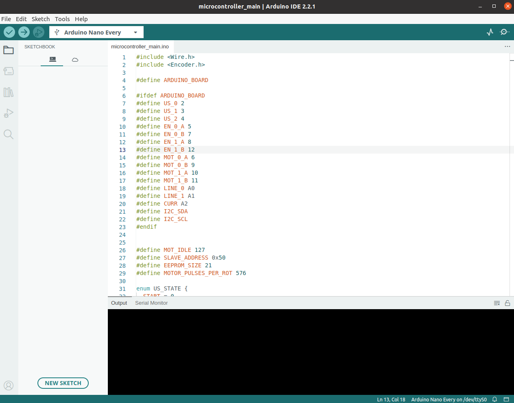
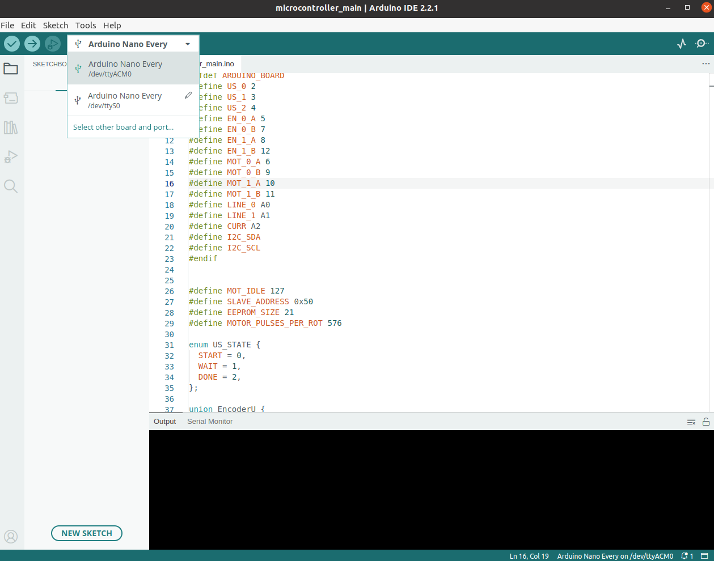
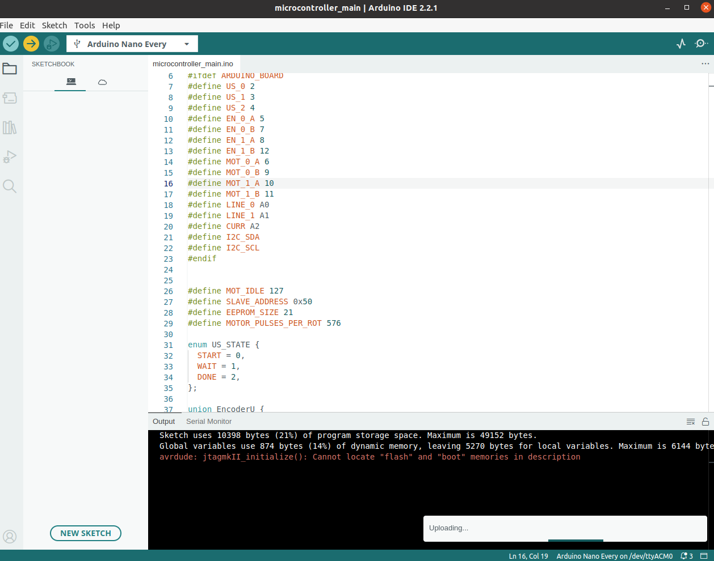

# Arduino Programming

## HW Required
    
 - Host PC with Arduino Studio IDE installed [see here](https://www.arduino.cc/en/software).
 - Arduino Nano "Every" (Original or clone, Every need for more external interrupts)
 - USB cable to connect Arduino with PC
 - Arduino PCB for Fenrir Project

## Programming

Open the `software/arduino_nano/main/main.ino` file in the Arduino IDE.

Connect the Arduino Every to the 

Try to build the firmware using the "Verify" button in left top.

If build goes ok, try to upload the firmware using the "Upload" button in left top.

Using the `ctrl+shift+M` open terminal and check if microcontroller communicates.

## Program Description

... TODO ...

